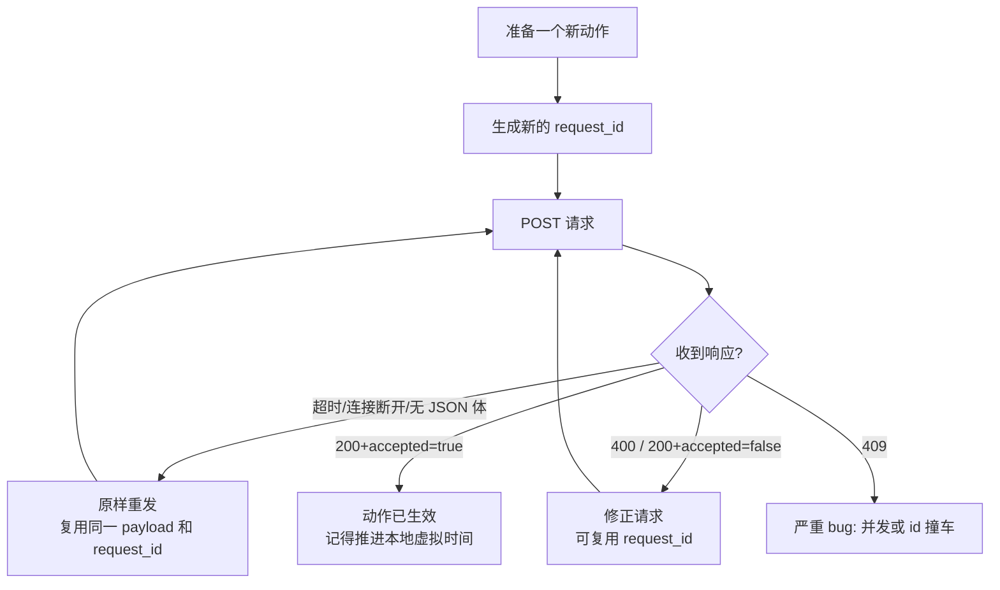

# 无线电干扰源环境模拟器 · 编程手册

> 2026 高教社杯全国大学生数学建模竞赛 **B 题：无线电干扰源的快速自动定位与清除**
> 面向"机器狗"程序开发者的实操手册
> 编写日期：2026-09-10

---

## 0. 编程语言选型结论

### 结论：**用 Python**

| 维度 | Python | MATLAB | C++ / Go / Rust |
|---|---|---|---|
| 官方示例 | ✅ 附件 2 第 11 节给出完整 Python 示例 | ✅ 同样给出 MATLAB 示例 | ❌ 无 |
| 本机环境 | ✅ 已装 **Python 3.14.3** | 需确认授权与版本 | 需额外工具链 |
| 依赖 | ✅ 标准库 `urllib` 即可跑通，零第三方依赖 | 需 MATLAB 许可 | 需编译 |
| 几何/数值 | ✅ `numpy` / `scipy`（交会、最小二乘、聚类） | 强 | 弱 |
| 路径规划 | ✅ `networkx` / `ortools` 直接可用 | 弱 | 需自行实现 |
| 调试迭代速度 | ✅ 脚本级，改完即跑 | 一般 | 慢 |
| 日志/JSON | ✅ 内置 `json`、`dataclasses` | 一般 | 需库 |

**推荐技术栈（渐进式，按需引入）**

```
必装：Python ≥ 3.10（本机 3.14.3）
核心：标准库 http.client / urllib.request / json  →  无需安装任何东西
可选：numpy, scipy          # 交会定位、示向度误差处理、最小二乘拟合
可选：networkx, ortools     # 巡检路径规划（TSP / 覆盖路径）
可选：matplotlib            # 可视化轨迹与定位区域，用于写论文配图
```

> **MATLAB 仅在这些情况下才值得选**：全队只熟悉 MATLAB，且题目要求的几何计算
> 手写实现成本可接受。否则一律选 Python —— 官方示例、依赖、求解器生态全面占优。

---

## 1. 五分钟跑通第一条指令

### 1.1 文件布局

```
d:\2026cumcm\codes\
├── .vscode\
│   ├── launch.json          # ★ F5 调试配置（4 套）
│   └── settings.json        # 解释器、UTF-8、终端编码
├── config.json              # 接口地址、参赛队号、物理常数
├── sim_client.py            # ★ 通信客户端（4 条指令，无策略）
├── probe_simulator.py       # 连接测试脚本
├── robot.py                 # ← 待写：搜索 / 定位 / 清除策略
├── logs/                    # 客户端行为日志（JSONL）
└── _extracted/              # docs 下 PDF/DOCX 提取出的纯文本（便于检索）
```

### 1.2 填写参赛队号

打开 `config.json`，把 `robot_id` 改成**当前登录模拟器用的参赛队号**（逐字节一致）：

```json
{ "base_url": "http://127.0.0.1:2026", "robot_id": "T2026xxxxxx" }
```

### 1.3 连接测试

**第一步：确认模拟器在跑**

```powershell
python probe_simulator.py
```

**第二步：在模拟器里开始一局"问题 3 演练测试"**

模拟器流程：


等界面显示 **"机器狗接口已经就绪"** 后（倒计时结束），立刻再跑一次：

```powershell
python probe_simulator.py --enter
```

`--enter` 会依次执行 `/enter → /measure(0,0,ch1) → /exit`，全链路验证并自动收尾。

**第三步：写你自己的策略**

```python
from sim_client import SimulatorClient

with SimulatorClient("http://127.0.0.1:2026", "T2026xxxxxx", log_dir="logs") as sim:
    info = sim.enter()
    print("本局可用现实时间：", info.remaining_real_duration_s, "秒")

    r = sim.measure(0, 0, 1)                 # 原地检测频道 1
    if r.measure_result == "direction":
        print("示向度", r.svd_deg)

    # … 你的定位 / 清除逻辑 …

    sim.exit()
```

> `with` 块会在异常时自动补一次 `/exit` 并关闭日志文件。

### 1.4 用 F5 直接运行（推荐）

`.vscode/launch.json` 里已配好，**按 F5 默认执行第一项**（连接测试）。

| 配置 | 作用 |
|---|---|
| ① 连接测试（`probe_simulator.py`） | **F5 默认项**，探测端口与接口状态 |
| ② 连接测试 + 全链路（`--enter`） | 额外跑 `/enter → /measure → /exit` |
| ③ 机器狗策略（`robot.py`） | 需先创建 `robot.py` |
| ④ 运行当前文件 | 打开任意 `.py` 后 F5 即运行它 |

切换配置：按 **F5 旁的下拉箭头**，或 `Ctrl+Shift+P` → "调试: 选择并开始调试"。

配套设置（`.vscode/settings.json`）：

- 默认解释器 `D:\Python\Python314\python.exe`
- `PYTHONUTF8=1` / `PYTHONIOENCODING=utf-8` —— 保证中文输出不乱码
- 文件统一 UTF-8 + CRLF 换行

> 调试配置的 `cwd` 固定为工作区根目录，因此 `config.json`、`logs/` 等相对路径都能正确定位。

---

## 2. 物理世界速查表

### 2.1 坐标系与角度

- 目标区域：**半径 1800 m 的圆**，圆心即原点 $(0,0)$，干扰源一定在圆内。
- $x$ 轴正向 = 正东，$y$ 轴正向 = 正北，单位 **米**。
- 方位角：正东 $0^\circ$，**逆时针为正**，正北 $90^\circ$，正西 $180^\circ$，正南 $270^\circ$，范围 $[0^\circ, 360^\circ)$。

由检测点 $S$ 指向干扰源 $G$ 的真实方位角：

$$\theta = \operatorname{atan2}(y_G - y_S,\; x_G - x_S) \bmod 360^\circ$$

**示向度** $\hat\theta$ 是测向机读数，满足

$$|\hat\theta - \theta| \le 1^\circ$$

同一地点电磁环境固定 ⇒ **重复检测不会改变误差**，只有换地点才会重新抽样。

### 2.2 常量

| 量 | 取值 | 说明 |
|---|---|---|
| 机器狗速度 | $5\ \mathrm{m/s}$ | 沿直线移动 |
| 检测动作耗时 | $5\ \mathrm{s}$ | 每次 `/measure` 固定 |
| 频道切换耗时 | $1\ \mathrm{s}$ | 任意两频道间；**只有 `/measure` 会触发** |
| 清除·未发现 | $3\ \mathrm{s}$ | 仅精确定位 |
| 清除·成功 | $5\ \mathrm{s}$ | 精确定位 3 s + 激光 2 s |
| 近距离阈值 | $5\ \mathrm{m}$ | 距离 ≤ 5 m 且在覆盖内 ⇒ `near`，无示向度 |
| 清除半径 | $20\ \mathrm{m}$ | 只要 ≤ 20 m 就能成功清除 |
| 有效接收半径 | $1000 \sim 1500\ \mathrm{m}$ | 每个源不同，**接口不返回** |
| 干扰源总数 | $10 \sim 16$ | 具体个数未知 |
| 频道 | $\{1,\dots,20\}$ 整数 | 每频道最多 1 个源，且频道数 = 源数（互不相同） |
| 定向源覆盖 | $180^\circ$（两侧各 $90^\circ$，含边界） | 定向方向未知 |
| 目标区域半径 | $1800\ \mathrm{m}$ | |
| 虚拟世界限时 | $360000\ \mathrm{s}$（=100 h） | 通常不构成约束 |
| 现实限时 | $1200\ \mathrm{s}$（=20 min） | `/enter` 起算 |
| 测试窗口 | $25\ \mathrm{min}$ | 与 20 min 取**较早者** |
| 坐标分量上限 | $\lvert x\rvert, \lvert y\rvert \le 2\times10^6$ | 超出 → HTTP 400 |
| 请求体上限 | $65536$ 字节 | 超出 → HTTP 413 |

### 2.3 三类检测结果

| `measure_result` | 含义 | 是否返回 `svd_deg` |
|---|---|---|
| `direction` | 收到信号，返回含误差的示向度 | ✅（保留 2 位小数） |
| `near` | 距离 ≤ 5 m 且在覆盖内，信号过强 | ❌ |
| `no_signal` | 收不到信号 | ❌ |

> ⚠️ **`no_signal` ≠ 附近没有干扰源。** 三种可能：① 该频道源已被清除；② 距离 > 有效接收半径（1000–1500 m 未知）；③ 是定向源但当前位置不在它的 $180^\circ$ 覆盖扇区内。

### 2.4 两种清除结果

| `clear_result` | 条件 | 耗时 |
|---|---|---|
| `success` | 20 m 内存在该频道**未清除**的源 | 5 s |
| `no_target_in_range` | 该频道无源 / 已被清除 / 距离 > 20 m | 3 s |

> 清除只看距离，**与定向源的朝向无关**。同一个源只能清除一次。

---

## 3. 虚拟时钟模型（核心）

### 3.1 只有两条指令推进时钟

| 指令 | 推进虚拟时钟？ | 备注 |
|---|---|---|
| `POST /enter` | ❌ | 但开始计**现实**运行时间 |
| `POST /measure` | ✅ | |
| `POST /clear` | ✅ | |
| `POST /exit` | ❌ | |
| 任何 `accepted=false` | ❌ | 响应中 `virtual_time_s` 恒为 `0`（**不是**当前虚拟时刻！） |

### 3.2 单次指令耗时公式

**`/measure`：**

$$T = \underbrace{\frac{\lVert P_{\text{new}} - P_{\text{last}}\rVert}{5}}_{\text{移动}} + \underbrace{\mathbb{1}[\text{channel} \ne \text{当前频道}] \cdot 1}_{\text{切频道}} + \underbrace{5}_{\text{检测}}$$

**`/clear`：**

$$T = \underbrace{\frac{\lVert P_{\text{new}} - P_{\text{last}}\rVert}{5}}_{\text{移动}} + \underbrace{3 \text{ 或 } 5}_{\text{精确定位（+清除）}}$$

**关键推论**

1. `/clear` 的 `channel` 只是"我要清除哪个源"，**不切频道、不产生 1 秒开销**。
2. 只有**合法** `/measure` 才会把测向机当前频道更新为本次 `channel`。
3. 因此"原地连续检测多个频道"很便宜：每换一个频道只多 1 秒。

### 3.3 手算示例（与附件 2 第 10 节一致）

| 步骤 | 指令 | 位置 | 频道 | 移动距离 | 移动 | 切换 | 动作 | 本步合计 | 虚拟时刻 |
|---|---|---|---|---|---|---|---|---|---|
| 1 | `/enter` | — | — | 0 | 0 | 0 | 0 | 0 | 0 |
| 2 | `/measure` | (300, 400) | 1 | 500 m | 100 | 0 | 5 | 105 | 105 |
| 3 | `/measure` | (300, 400) | 2 | 0 | 0 | **1** | 5 | 6 | 111 |
| 4 | `/clear` | (300, 0) | 3 | 400 m | 80 | **0** | 3 | 83 | 194 |
| 5 | `/measure` | (300, 0) | 2 | 0 | 0 | **0** | 5 | 5 | 199 |
| 6 | `/exit` | — | — | 0 | 0 | 0 | 0 | 0 | 199 |

第 5 步没有切换耗时：测向机在第 3 步后已停在频道 2，第 4 步的 `/clear` 不影响它。

**据此可估算时间预算：**

- 直线往返 1800 m 半径区域一次 $\approx 3600/5 = 720\ \mathrm{s}$（虚拟）。
- 20 min 现实时间下，虚拟耗时约可做 **200–400 次检测**（取决于移动量）。
- 一次"定位一个源"的典型成本：3–6 次检测 + 1 次成功清除 $\approx 100\text{–}400\ \mathrm{s}$ 虚拟时间。

---

## 4. 通信协议

### 4.1 请求公共字段

| 字段 | 类型 | 取值 |
|---|---|---|
| `arena_id` | string | **必须** `"default"` |
| `robot_id` | string | 与当前登录参赛队号**逐字节一致**，UTF-8 长度 1–64 字节 |
| `request_id` | string | 本局幂等键，UTF-8 长度 1–128 字节，每个新动作必须换新值 |

其余约束：

- 路径**精确**为 `/enter`、`/measure`、`/clear`、`/exit`；**不接受尾随斜线和查询参数**。
- `Content-Type: application/json`，可带且**只允许** `charset=utf-8`；`Content-Encoding` 省略或 `identity`。
- 请求体：无 BOM 的 UTF-8 JSON 对象、**不能有重复键**、嵌套 ≤ 16 层、≤ 65536 字节。
- `channel` 必须是 `1..20` 的整数；写成 `1.0` 可接受，`1.5` 报 400。
- **未声明的字段不会被忽略** → 返回 `HTTP 200` + `accepted=false`（用来帮你发现拼写错误）。
- `robot_id` / `request_id` 不能含控制字符或不可见格式字符。

### 4.2 响应公共字段

| 字段 | 类型 | 含义 |
|---|---|---|
| `accepted` | boolean | 是否接受并执行 |
| `real_timestamp_ms` | number | 模拟器响应时的现实时间戳（ms） |
| `virtual_time_s` | number | 虚拟时钟（s）；**可能带小数，不要按整数解析** |

`accepted=false` 时**只有这 3 个字段**，没有检测结果 / 清除结果 / 退出原因。

### 4.3 四条指令

#### `POST /enter`

请求：`{arena_id, robot_id, request_id}`

响应（`accepted=true`）：

| 字段 | 说明 |
|---|---|
| `max_virtual_duration_s` | 默认 360000 |
| `max_real_duration_s` | 默认 1200 |
| `remaining_real_duration_s` | **本局实际可用的整秒数，0–1200** |

> 晚于窗口开启后 5 分钟才进入时，`remaining_real_duration_s < 1200`。
> **必须用这个值做时间预算，不要硬编码 1200。**

#### `POST /measure`

请求：`{arena_id, robot_id, request_id, position:{x,y}, channel}`

响应：`measure_result` ∈ `{direction, near, no_signal}`，`direction` 时附带 `svd_deg`。

#### `POST /clear`

请求：`{arena_id, robot_id, request_id, position:{x,y}, channel}`

响应：`clear_result` ∈ `{success, no_target_in_range}`。

#### `POST /exit`

请求：`{arena_id, robot_id, request_id}`

响应附加 `exit_reason`，主动退出固定为 `"user_exit"`。

### 4.4 HTTP 状态码全表

| 状态 | 含义 | 能否重试 |
|---|---|---|
| `200` + `accepted=true` | 动作已执行 | — |
| `200` + `accepted=false` | JSON 合法但被拒；或含未知字段；或 `arena_id`/`robot_id` 不匹配 | 修正后可复用同一 `request_id` |
| `400` | JSON 语法、重复键、缺字段、类型、标识符格式、频道或坐标范围错误 | 修正后可复用 |
| `404` | 路径未知或不精确 | ❌ 改路径 |
| `405` | 已知路径用了非 POST | ❌ 改方法 |
| `409` | 同一 `request_id` 对应不同动作，或并发发送了不同动作 | ❌ **说明有 bug** |
| `413` | 请求体 > 65536 字节 | ❌ |
| `415` | `Content-Type` / `Content-Encoding` 不受支持 | ❌ |
| `429` | 连接/无效流量保护触发，或本局幂等记录达到上限 | 降速 / 检查循环 |
| `500` | 模拟器内部错误 | 谨慎重试 |

> **必须同时检查 HTTP 状态码和 `accepted`**，不能只看其一。
> `404/405/413/415` 通常说明代码写错了；`409` 几乎必然意味着你并发发请求了。

### 4.5 幂等与重试（最容易踩的坑）



三条铁律：

1. **每个新动作 = 新 `request_id`**。
2. **重试同一动作 = 复用原请求内容 + 原 `request_id`**（模拟器返回第一次的完整响应，不会重复移动/检测/清除/推进时间）。
3. **绝不并发发送不同动作**（正常串行没有速率上限；并发会 409）。

哪些情况**不占用** `request_id`（修正后可复用）：

- `HTTP 400` 结构错误
- `HTTP 200 + accepted=false`（未知字段、`arena_id`/`robot_id` 不匹配）

---

## 5. 客户端 API（`sim_client.py`）

```python
from sim_client import SimulatorClient

sim = SimulatorClient(
    base_url="http://127.0.0.1:2026",
    robot_id="T2026xxxxxx",
    timeout=5.0,          # 单次 HTTP 超时
    retries=3,            # 仅对"连不上"重试，且复用原 request_id
    log_dir="logs",       # 写 JSONL 行为日志
)

info = sim.enter()                        # → EnterResponse
info.remaining_real_duration_s            # 本局现实可用秒数

r = sim.measure(300, 400, 1)              # → ActionResponse
r.measure_result                          # 'direction' | 'near' | 'no_signal'
r.svd_deg                                 # direction 时才有，含 ±1° 误差
r.virtual_time_s                          # 本次动作后的虚拟时刻

c = sim.clear(300, 0, 3)                  # → ActionResponse
c.clear_result                            # 'success' | 'no_target_in_range'

sim.exit()
sim.close()
```

客户端内部维护的状态：

| 属性 | 含义 |
|---|---|
| `sim.position` | 机器狗当前坐标（用于本地估算移动耗时） |
| `sim.channel` | 测向机当前频道（决定是否产生 1 s 切换耗时） |
| `sim.virtual_time_s` | 最近一次 `accepted=true` 的虚拟时刻 |
| `sim.remaining_real_s` | `/enter` 返回的现实时间预算 |

### 日志格式（`logs/robot-*.jsonl`）

每行一个 JSON 事件，便于赛后复盘与论文取证：

```json
{"event":"response","path":"/measure","http_status":200,"request_id":"measure-3","attempt":1,"elapsed_ms":12.4,"accepted":true,"virtual_time_s":111.0,"payload":{"measure_result":"direction","svd_deg":123.45,"...":"..."}}
{"event":"transport_error","path":"/measure","request_id":"measure-4","attempt":1,"error":"URLError: ..."}
```

> 模拟器**不会**替你记录机器狗程序的指令序列，必须自己记。

---

## 6. 编程注意事项（协议原文 12 条 + 补充）

1. 先在模拟器里**在线登录**并启动测试，等界面提示接口就绪。
2. `robot_id` 用当前登录的参赛队号。
3. 每个新动作用新 `request_id`；只对完全相同的重试复用原 id 与原请求内容。
4. 逐次等待响应，**不得并发**发送不同动作。
5. 同时检查 HTTP 状态和 `accepted`；`accepted=false` 时 `virtual_time_s=0` **不是**当前虚拟时刻。
6. 用 `/enter` 的 `remaining_real_duration_s` 控制现实运行时间，别假设一定有 1200 秒。
7. 每次检测增加的 5 秒是**虚拟**耗时，现实中无需等待。
8. 只有 `measure_result="direction"` 才读 `svd_deg`，且它不是精确真方位。
9. `/clear` 不切换测向机频道；只有成功的 `/measure` 会更新当前频道。
10. `no_signal` 不等于附近没有干扰源（可能超距或不在定向覆盖内）。
11. 测试结束后接口关闭，**不要**再调 `/exit` 查原因。
12. 判断业务结果时用实际字符串 `direction` / `near` / `no_signal` / `success` / `no_target_in_range` / `user_exit`，**不要**依赖界面中文。
13. 机器狗程序自行记录指令序列与响应。
14. 倒计时未结束 / 测试已结束 / 接口未开放时，连接可能**直接失败且无 JSON 体** —— 必须同时处理"连不上"和"收到 JSON"两种情况。
15. 加密日志上传上限 2 MB：**避免异常高频循环**（演练时留意日志大小）。
16. 坐标必须有限且 $|x|, |y| \le 2\times10^6$；`NaN` / `±inf` → HTTP 400，**请求不执行、不推进位置与虚拟时间**。
17. 单位一致性：所有距离用米，角度用度，时间用秒。
18. 本地虚拟时间只做预算估算，**以响应里的 `virtual_time_s` 为准**（模拟器按微秒累计）。

---

## 7. 测试流程与时间线

### 7.1 七个阶段

| 阶段 | 模拟器行为 | 机器狗可做的事 |
|---|---|---|
| 1. 确认开始 | 准备案例数据 | 不能连接 |
| 2. 5 秒倒计时 | 接口**未开放** | 连接失败属正常 |
| 3. 窗口开启（25 min） | 开放接口 | 立即 `/enter` |
| 4. `/enter` 成功 | 开始计 20 min | 记录 `remaining_real_duration_s` |
| 5. 执行任务 | 串行响应 | `/measure`、`/clear` 循环 |
| 6. `POST /exit` | 结束计时、关闭接口 | 生成日志 |
| 7. 日志导出 | 自动加密 + 加入上传队列 | 从日志列表导出 → 支撑材料 |

### 7.2 结束测试的全部途径

`/exit`、手工中止、25 min 窗口超时、`/enter` 后 20 min 超时、虚拟时间超时、技术异常。

> "中止测试"不能取消本次测试，正式测试中同样**占用一次机会**。

### 7.3 关键时间限制

| 日期/时间（北京时间） | 约束 |
|---|---|
| **2026-09-13 17:30** | 之后**不能启动**新的演练 / 正式测试（已开始的可正常完成） |
| **2026-09-13 15:30** | 官方建议在此前完成全部正式测试（避免网络拥堵） |
| 本机时间与服务器差 > 60 s | 不能启动新测试（会重新校时） |

- 演练测试**不限次数**，结束时会显示本局干扰源总数 / 全向数 / 定向数。
- 正式测试**问题 3、问题 4 各 3 次**，且任何界面都不显示案例真值。
- 每局会显示**测试案例编码**，用于填表与日志关联。
- 同一账号**不能同时在两台设备**使用；设备崩溃时服务器最多需约 120 s 释放会话。

---

## 8. 输出要求（论文用）

### 表 1 格式（问题 3、问题 4 各三次正式测试）

| 测试案例编码 | 清除干扰源个数 | 平均定位清除时间 | 程序运行时间 |
|---|---|---|---|
| 测试 1 案例编码 | | | |
| 测试 2 案例编码 | | | |
| 测试 3 案例编码 | | | |

$$\text{被清除干扰源个数的比例} = \frac{\text{被清除干扰源的个数}}{\text{干扰源总数}}$$

$$\text{平均定位清除时间} = \frac{\text{定位清除总时间}}{\text{被清除干扰源的个数}}$$

其中**定位清除总时间**包含：机器狗移动时间 + 频道切换时间 + 检测时间 + 光学精确定位时间 + 清除时间。

> 支撑材料需附上从模拟器导出的**三次正式测试日志文件**（**不要修改文件名**）。

---

## 9. 建模与算法方向（供设计策略参考）

### 问题 1：交会定位的区域直径

- 两个检测点各测一次，得到两条"实测示向度方向"，每条再各偏移 $\pm 1^\circ$ 得两条虚线，四条线围成**红色四边形**（定位区域）。
- 求其**直径** $= \max_{P,Q \in \mathcal{R}} \lVert P - Q \rVert$。
- 对凸多边形，直径由**顶点对**取得 ⇒ 旋转卡壳 $O(n\log n)$ 或直接 $O(n^2)$ 枚举顶点对即可。
- "以直径为直径的圆能否覆盖该区域"：圆覆盖凸区域 $\iff$ 区域的最大距离 ≤ 圆直径；结合**容斥/反例构造**讨论（例如长条状四边形时，外接圆直径必然 $\ge$ 区域直径，故必覆盖；需证）。

### 问题 2：第二个检测点选择

- 单点示向度 + 误差 $\pm 1^\circ$ 给出一个**扇形不确定区**，第二个点与该扇形交会出的四边形面积/直径最小者最优。
- 若只允许"已知一个检测点及示向度"先验，则候选区域是**与原检测点距离适中、夹角接近 $90^\circ$ 的弧带**。
- 目标函数建议：$\min$ 定位区域直径，或 $\min \mathbb{E}[\text{面积}]$；用 Monte-Carlo 对 $\pm1^\circ$ 误差抽样求期望。

### 问题 3：全向源的自动搜索与清除

推荐分层策略：

1. **粗筛（全局扫频道）**：沿规划路径在若干驻点依次检测 20 个频道（原地切换每频道仅 +1 s），建立"哪个频道在哪个区域有信号"的**存在性地图**。
2. **有效接收半径反推**：用"刚出现信号 / 刚消失信号"的两点距离二分估计 $R$，缩小搜索范围（$R \in [1000, 1500]$）。
3. **交会定位**：对同一频道在两个以上相距足够远的点取示向度，解**最小二乘交会**（或按问题 1 的四边形取几何中心）。
4. **逼近清除**：沿估计方向前进，`near` 出现 ⇒ 直接 `/clear`；否则进入 20 m 圈后 `/clear`。
5. **路径规划**：把已定位的源当作节点做 **TSP / 最近邻 + 2-opt**；未定位的频道用**覆盖式扫描**（同心圆或阿基米德螺线，螺距 $\approx 2\sqrt{R_{\min}^2 - r^2}$ 保证不漏）。
6. **时间控制**：以 `remaining_real_duration_s` 与当前 `virtual_time_s` 做预算，预留退出时间；接近上限时优先清除**已定位**的源。

### 问题 4：加入定向源

- 定向源覆盖仅 $180^\circ$ ⇒ **同一频道在两点可能一点有信号、一点无信号**，"无信号"不再是"没有源"的证据。
- 需要**方向一致性检验**：对同一频道多点采样，若示向度解出的位置自相矛盾 ⇒ 疑似定向源，再用"绕圆多点采样"确定其扇区边界（信号出现/消失的两个方位角夹出 $180^\circ$ 扇区）。
- 清除仍只看 20 m 距离，**与朝向无关**：一旦逼近到 20 m 内即可清除。

---

## 10. 常见坑速查

| 症状 | 原因 | 处理 |
|---|---|---|
| 连接被直接重置，无 JSON 体 | 倒计时中 / 未开放 / 测试已结束 | 属正常；等界面提示就绪 |
| `HTTP 200` + `accepted=false` | 字段拼写错误 / `robot_id` 不匹配 / 忘了先 `/enter` | 对照字段表逐字检查 |
| `HTTP 409` | 并发发送不同动作，或 `request_id` 撞车 | 改串行；每个新动作换新 id |
| `HTTP 400` 坐标错误 | `NaN` / `inf` / $\lvert\text{坐标}\rvert > 2\times10^6$ | 加范围校验 |
| 时间预算算错 | 把 `accepted=false` 的 `virtual_time_s=0` 当成当前时刻 | 只信最近一次 `accepted=true` 的响应 |
| 虚拟时间莫名多 1 秒 | `/measure` 换了频道 | 原地测多频道时按 1 s/次累加 |
| 以为 `/clear` 会切频道 | 误解协议 | `/clear` 的 `channel` 只是目标频道 |
| `no_signal` 就判定"无源" | 忽略有效接收半径与定向覆盖 | 多种原因，需交叉验证 |
| 重试后虚拟时间翻倍 | 重试时换了新 `request_id` | 必须复用原 id 与原内容 |
| `svd_deg` 当精确方位用 | 忽略 $\pm1^\circ$ 误差 | 用多点交会平滑 |
| 日志超 2 MB | 异常高频循环 | 加节流；演练时检查日志大小 |

---

## 11. 附：环境信息（本机实测）

| 项 | 值 |
|---|---|
| Python | **3.14.3** |
| 已装相关库 | `pymupdf 1.28.0`（读 PDF 用） |
| 模拟器进程 | `jammers-simulator-full.exe` |
| 模拟器路径 | `D:\BaiduNetdiskDownload\CUMCM2026B\Jammers-simulator-full\` |
| 接口地址 | `http://127.0.0.1:2026`（**只监听回环**，其他电脑无法访问） |
| 模拟器数据目录 | 同目录下 `JammersSimulatorData\`（含 `startup.log`、`behavior-logs\`） |
| 模拟器下载 | https://pan.baidu.com/s/1P1yfVjY0RufU93XOdzhOLw?pwd=2026 （提取码 2026） |
| 技术支持邮箱 | cumcm2026b@163.com |

> 移动模拟器位置时须**整体移动目录**（数据文件在其所在目录）。
